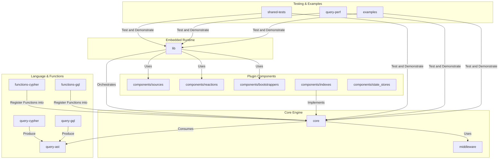

# AGENTS.md: `drasi-core`

`drasi-core` is a high-performance, embeddable library for executing **continuous queries** over streaming data. It processes streams of changes (inserts, updates, deletes) to incrementally compute result sets using a graph-based data model. The engine is modular, extensible, and backend-agnostic.

**Two entry points:**
- **Query Engine**: `QueryBuilder` in the `core` crate for low-level query processing
- **Embedded Runtime**: `DrasiLib` in the `lib` crate for full sources → queries → reactions pipeline

See **`readme.md`**: Consult for concrete usage examples of `QueryBuilder` and `SourceChange` processing.

## Project Architecture

The repository is a Rust workspace organized into the following layers:

### Crate Breakdown

#### Core Engine
*   **`core`**: The engine's heart. Contains orchestration logic (`QueryBuilder`, `ContinuousQuery`), the evaluation pipeline, path solver, and abstract storage `interface` traits.
*   **`query-ast`**: Defines the language-agnostic Abstract Syntax Tree (AST), the common contract between parsers and the engine.
*   **`query-cypher` / `query-gql`**: Language frontends. They parse query strings into the `query-ast` structure.
*   **`functions-cypher` / `functions-gql`**: Standard libraries of language-specific functions (e.g., `toUpper`, `coalesce`) that register with the core engine.
*   **`middleware`**: A library of pluggable data transformation components (e.g., `unwind`) for pre-processing `SourceChange` events.

#### Embedded Runtime
*   **`lib`**: Full embedded runtime with `DrasiLib` builder. Orchestrates sources, queries, and reactions with channel-based event routing, priority queues, and backpressure support. **DrasiLib has zero awareness of which plugins exist** - all plugins implement traits and are passed at runtime.

#### Plugin Components (`components/`)
*   **`components/sources/`**: Source plugins (postgres, http, grpc, mock, platform, application)
*   **`components/reactions/`**: Reaction plugins (http, grpc, sse, log, storedproc-postgres, storedproc-mysql, storedproc-mssql)
*   **`components/bootstrappers/`**: Bootstrap providers (postgres, scriptfile, platform, application, noop)
*   **`components/indexes/`**: Storage backend plugins (rocksdb, garnet)
*   **`components/state_stores/`**: State store plugins (redb)

#### Testing & Examples
*   **`shared-tests`**: A reusable compliance test suite ensuring behavioral consistency across all storage backends.
*   **`query-perf`**: CLI tool for benchmarking and performance testing.
*   **`examples`**: Runnable programs demonstrating library usage.

## Build Prerequisites
*   **Rust**: Install via [rustup](https://rustup.rs/). Uses Rust 1.83.0 (see `rust-toolchain.toml`).
*   **libjq**: Required for the `middleware` crate.
    *   Install via package manager (e.g., `brew install jq`, `apt-get install libjq-dev`).
    *   Set `JQ_LIB_DIR` env var if the build fails to locate it (e.g., `/opt/homebrew/lib` on macOS).

## Project Rules & Requirements

### Code Conventions (Strictly Enforced)
*   **No `.unwrap()`**: Use `?` operator or explicit error handling. CI enforces `clippy::unwrap_used`.
*   **No `print!`/`println!`**: Use the `log` crate macros (`info!`, `error!`, etc.). CI enforces `clippy::print_stdout`.
*   **License Header**: Every new `.rs` file MUST start with the Apache 2.0 header.
*   **DCO Sign-off**: All commits MUST include a `Signed-off-by:` line. Use `git commit -s`.

### Key Architectural Principles
*   **Interface-Driven**: The `core` crate defines abstract `trait`s (`ElementIndex`, `ResultIndex`) to decouple logic from storage.
*   **Pluggable Backends**: Storage implementations are swappable at runtime via dependency injection.
*   **Plugin Architecture**: The `lib` crate has zero awareness of plugins - they implement traits (`Source`, `Reaction`, `BootstrapProvider`) and are passed at runtime.
*   **Pipeline Processing**: Data flows linearly: `Source` -> `Middleware` -> `Path Solver` -> `Evaluator` -> `Reaction`.
*   **Declarative Config**: Queries and middleware pipelines are defined declaratively.

## Development Workflows

### Core Engine Tasks

*   **Add a new Function**:
    1.  Implement `ScalarFunction` or `AggregatingFunction` traits (found in `core`).
    2.  Register the function in the `FunctionRegistry`.
    3.  Add validation tests in `shared-tests/src/use_cases`.

*   **Add a Storage Backend**:
    1.  Create a new crate in `components/indexes/` implementing `ElementIndex`, `ResultIndex`, and `FutureQueue`.
    2.  Implement `IndexBackendPlugin` trait for runtime integration.
    3.  Add `shared-tests` as a `dev-dependency` and run the standard suite.

*   **Add Middleware**:
    1.  Implement `SourceMiddleware` and `SourceMiddlewareFactory` in `middleware` crate.
    2.  Register in the middleware registry.

### Plugin Development Tasks (lib crate)

*   **Add a Source Plugin**: See `components/sources/README.md`
    1.  Create new crate in `components/sources/`.
    2.  Define typed configuration struct.
    3.  Implement `Source` trait using `SourceBase`.
    4.  Handle lifecycle: `start()`, `stop()`, `subscribe()`.

*   **Add a Reaction Plugin**: See `components/reactions/README.md`
    1.  Create new crate in `components/reactions/`.
    2.  Define typed configuration struct.
    3.  Implement `Reaction` trait using `ReactionBase`.
    4.  Subscribe to queries via `QueryProvider`.

*   **Add a Bootstrap Provider**: See `components/bootstrappers/README.md`
    1.  Create new crate in `components/bootstrappers/`.
    2.  Implement `BootstrapProvider` trait.
    3.  Send `BootstrapEvent` items through provided channel.

*   **Add a State Store Provider**: See `components/state_stores/README.md`
    1.  Create new crate in `components/state_stores/`.
    2.  Implement `StateStoreProvider` trait.
    3.  Provide key-value storage with store_id partitioning.

### CI Conventions
*   **`test.yml`**: Runs `cargo test`. Blocks PR merge.
*   **`ci-lint.yml`**: Runs `clippy` (no unwraps/prints) and `fmt`. Blocks PR merge.
*   **`devskim.yml`**: Security scanner. Blocks PR merge on findings.
*   **`coverage.yaml`**: Reports code coverage.

## Query Limitations

Drasi Core does **not** support these Cypher/GQL clauses in continuous queries:
- `ORDER BY`
- `TOP`
- `LIMIT`
