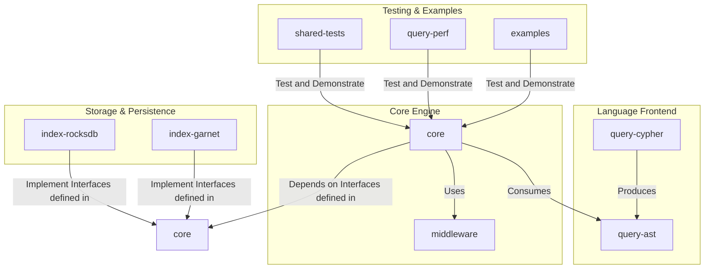

# AGENTS.md: `drasi-core`

## Overview

This repository contains `drasi-core`, a high-performance, embeddable library for executing **continuous queries** over streaming data. A continuous query processes a stream of data changes (inserts, updates, deletes) and incrementally computes a result set, emitting a "diff" of what changed.

The engine is modular, extensible, and backend-agnostic. It uses a graph-based data model and the Cypher query language. The primary entry point is the `QueryBuilder` in the `core` crate.

## Project Architecture & Crate Breakdown

The repository is a Rust workspace. The architecture separates the query language frontend, the core evaluation engine, and the storage backend.

### Crate Responsibilities

*   **`core`**: The engine's heart. Contains orchestration logic (`QueryBuilder`), the evaluation pipeline, path solver, and abstract storage `interface` traits.
*   **`query-ast`**: Defines the language-agnostic Abstract Syntax Tree (AST), the common representation for parsed queries.
*   **`query-cypher`**: The Cypher language parser. It transforms a Cypher string into the `query-ast` structure.
*   **`middleware`**: Provides a library of pluggable data transformation components for pre-processing `SourceChange` events.
*   **`index-rocksdb`**: A persistent storage backend using the RocksDB embedded key-value store.
*   **`index-garnet`**: A persistent storage backend using a Garnet or Redis-compatible server.
*   **`shared-tests`**: A private test harness with a generic test suite for ensuring correctness across all storage backends.
*   **`query-perf`**: A private executable for performance testing and benchmarking.
*   **`examples`**: Runnable programs demonstrating library usage.

## Key Architectural Principles

*   **Interface-Driven Design**: The `core` crate defines abstract `trait`s for all major dependencies (especially storage) to decouple the engine from concrete implementations.
*   **Pluggable Backends**: Storage implementations (`index-rocksdb`, `index-garnet`) implement the `interface` traits, allowing them to be swapped out.
*   **Multi-Stage Processing Pipeline**: A `SourceChange` flows through a well-defined pipeline: Middleware -> Path Solving -> Evaluation.
*   **Declarative Configuration**: Queries and middleware are defined declaratively.

## Development Workflows and Conventions

### Common Tasks

*   **To add a new Cypher function**:
    1.  In the `core` crate, navigate to `core/src/evaluation/functions`.
    2.  Implement the `Scalar` or `Aggregating` function trait.
    3.  Register it in the `FunctionRegistry`.
    4.  Add a validation test in the `shared-tests` crate.

*   **To add a new storage backend**:
    1.  Create a new crate.
    2.  Implement the `ElementIndex`, `ResultIndex`, and `FutureQueue` traits from `drasi-core`.
    3.  Add `shared-tests` as a `dev-dependency`.
    4.  In your `tests/` directory, create a test runner that implements `shared_tests::QueryTestConfig` to run the `use_cases` suite against your backend. See `index-rocksdb/tests/scenario_tests.rs` for the canonical example.

*   **To add a new middleware**:
    1.  In the `middleware` crate, create a new module.
    2.  Implement the `SourceMiddleware` and `SourceMiddlewareFactory` traits from `drasi-core`.
    3.  Add a validation test in the `shared-tests` crate.

*   **To change the Cypher grammar**:
    1.  In the `query-cypher` crate, modify the `peg` grammar in `src/lib.rs`.
    2.  Update `query-ast` if the change requires a new AST structure.

### CI Conventions

Pull requests must pass the automated CI checks in `.github/workflows`.
*   **`test.yml`**: Runs `cargo test --workspace`. This is the primary correctness check.
*   **`ci-lint.yml`**: Runs `cargo clippy` and `cargo fmt`. Code must be free of warnings and correctly formatted.
*   **`coverage.yaml`**: Measures test coverage.
*   **`devskim.yml`**: Runs a security linter.